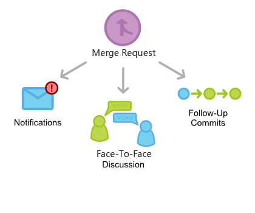
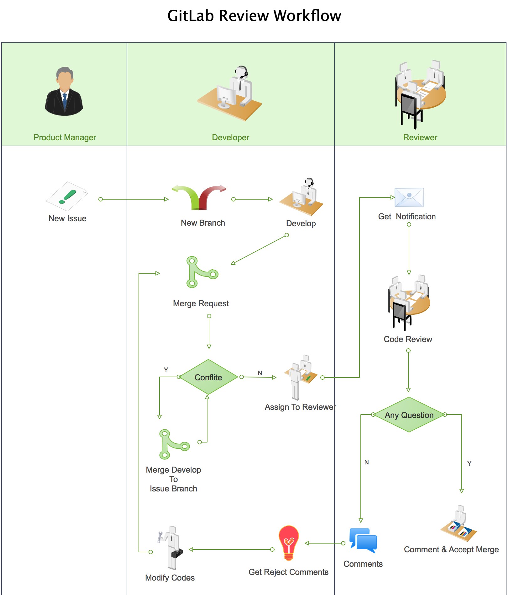

# Code Review 指南

## 目的
为了保证软件项目开发的代码实现质量，发现代码中的bug，保证项目组成员的沟通和对项目的了解，在实现功能的前提下，确保代码符合规范，同时保证代码的可读性和可维护性，因此需要进行阶段性Code Review（代码审查）。

## 模式

使用 Gitlab Merge Request（MR），通过 Face-To-Face 讨论方式来进行 Code Review，将提出的修改意见记录到 comments 里面，以便后续跟踪。时长控制在一个小时内。对于在外办公无法参加公司内部 Face-To-Face，则可以直接使用 Gitlab Merge Request（MR）的模式进行 Code Review。

## 流程

**参与人员定义：**

1. PM：产品管理
2. DEVELOPER：开发人员
3. REVIEW：Review人

**流程解析及主要事项：**

1. (PM) 新建 Issue：在 GitLab 上创建新的 Issue（开发需求），要求对需求进行详细的描述和说明。
2. (Developer) 创建开发分支：针对 PM 的 Issue，通过 Issue 面板，创建开发分支。
3. (Developer) 需求研发：针对此 Issue，进行需求研发。
4. (Developer) 提交合并请求：研发完成之后，在自测无误且跑完自动化测试脚本之后，可以发起一个 Merge Request 请求。
5. (Developer) 查看是否冲突：在 Issue 面板，查看提交的 Merge Request 是否有冲突。
6. (Developer) 如果提交的 Merge Request 有冲突，则将 Develop 分支合并到自身的 Issue 分支并完成冲突解决，重复步骤5。
7. (Developer) 如果提交的 Merge Request 没冲突，则将此次合并请求Assign 给 Reviewer，并在评论中 @Reviewers，确认此次 Review 成员及时间等事项。
8. (Reviewer) 收到 Merge 通知：Reviewer 可通过邮件或者 GitLab 消息面板查看 Merge 请求通知。
9. (Reviewer) Review 代码：针对此次提交，进行 Review，主要针对代码格式、业务逻辑等方面进行验收，具体可参看 Review 的具体实施。考虑到问题的及时响应、减少分歧以及增进交流，这里推荐尽量选择 Face-To-Face 的方式来进行 Review。
10. (Reviewer) 是否有问题：针对一系列验收及讨论，判断本次Merge是否存在问题。
11. (Reviewer) 如果没问题，则接受合并请求，完成本次合并。
12. (Reviewer) 如果有问题，则在代码上进行评论，并描述清楚问题及建议。
13. (Developer) 接收 Merge 反馈：开发者可通过邮件或GitLab通知面板，查看本次 Merge 反馈。
14. (Developer) 修改代码：针对 Merge 反馈，对自身代码进行修正调整，并 @Reviewers 进行问题确认，之后重复步骤5。

### 开发者流程

### Reviewer 流程

## Code Review 的具体实施

### 事前准备阶段

1. 对象

    一个 Issue 完成以后即可提交 Merge Request 。因此尽量保持 Issue 的开发范围不要太泛。

2. 内容

    我们对代码的审查内容很多，如代码的编写是否规范（注释的书写格式、命 名  规范等）、技术处理规范（异常处理、日志处理、代码组织结构等）、业务实现等。我们不能希望通过一次 Code Review 活动，完成所有这些内容的 审查， 因此我们必须设定本次 Code Review 活动内容界限，确定审查重点.

3. 评审规范和标准

    在 Code Review 前设计确定评审规范和标准是必要，通过规范和标准我们在审查过程中可以有据可依，有理可循，而且还可以做到标准统一。

4. 选择 Code Review 活动的参与者

    在 Code Review 开始前，必须把本次 Code Review 活动的对象、审查内容以及审查的规范和标准通报给所有的参与者。

5. 选择 Code Review 活动的组织形式

    Code Review 活动有很多形式可供我们选择，我们可以根据实际情况选择面对面一对一或者一对多的 Code Review， 远程查看的 Code Review 等等。

### 实施阶段

1.  准确记录

     对于 Code Review 过程发现的问题，可以使用在 Gitlab 直接提交 Comments 的方式或者在代码里面写 TODO、 FIXME 的注释等方式。

2.  讲解与提问
    - 代码作者讲解自己负责的代码和相关逻辑，
    - 代码审核者在此过程中可以随时提出自己的疑问，以及修正意见。

3.  注意气氛

     实施审查时，要营造一个讨论问题、解决问题的氛围，不能把审查会搞成批判会，这样会影响相关人员的积极性。

### 事后跟踪

1.  确认发现的问题
2.  修正问题责任者
3.  修正结果确认者

    做为修正结果的确认者，必须按照事前约定的时限及时的对修正结果进行全面的确认。

## 注意事项

-   尽量保持短暂频繁的节奏

    - 要 Review 代码越多，那么建议也会越来越多，重写的代码也越来越多。越接近研发后期，代码也不能修改太多。
    - 尽量不要在小问题上纠结太久，如果当场无法确认，可以在事后考虑清除以后确认。

-   尽量采用面对面的方式，人员不要太多

      主要是增进交流，即使响应，减少分歧，达成共识。但人员不要太多了，人多嘴杂反而适得其反。

-   尽可能的让不同的人Reivew你的代码

      如果可能的话，不要总是只找相同的人群来Review你的代码，不同的人有不同的思考方式，有不同的见解，所以，不同的人可以全面的从各个方面评论你的代码。

## Ref

- [Code Review Guidelines - GitLab Documentation](https://docs.gitlab.com/ce/development/code_review.html)
- [如何用 Gitlab 做团队内的 Code Review](https://segmentfault.com/a/1190000006062488)

